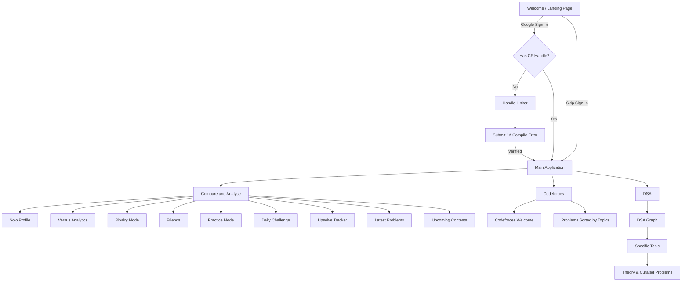

<div align="center">
  
  
  <p align="center">
    <strong>The ultimate gamified dashboard for competitive programmers. Track upsolves, build streaks, and challenge your friends to rating rivalries.</strong>
  </p>

  <p align="center">
    <a href="https://codeforces-tracker.vercel.app"><b>Website Live Demo</b></a> •
    <a href="#features"><b>Features</b></a> •
    <a href="#tech-stack"><b>Tech Stack</b></a> •
    <a href="#installation"><b>Installation</b></a>
  </p>

  <div>
    
    
    
    
  </div>
</div>

<br/>

## ✨ Features

🔥 **Rivalry Mode**
> Challenge your friends to a time-boxed rivalry! Set a deadline, and let the proprietary scoring algorithm calculate the winner based on total solves, monthly consistency, and rating growth. 

📊 **Versus Analytics**
> Compare any two Codeforces handles head-to-head. Dive deep into direct comparisons of rating histories, max streaks, and submission accuracy.

👤 **Solo Profile & Pie Charts**
> An advanced personal dashboard that visualizes your entire Codeforces journey. See your submission verdicts, language preferences, and rating distribution through beautiful, interactive pie charts and graphs.

📅 **Daily Challenges & Streaks**
> Consistency is key to becoming a Grandmaster. Get a curated daily challenge based on your current rating level. Solve it to maintain your streak.

📈 **The Upsolve Tracker**
> "Attempted but unsolved" is a CPer's worst enemy. The Upsolve Tracker automatically cross-references your entire submission history to surface problems you gave up on during contests.

🧩 **Practice by Topic & DSA Learning Path**
> Master specific algorithms! Browse and filter Codeforces problems sorted by exact tags (DP, Graphs, Math, Greedy) or follow the structured Data Structures & Algorithms learning graph.

⚡ **Latest Problems Feed**
> Stay up to date with a real-time feed of the most recently published problems on Codeforces, complete with difficulty ratings and tags.

📆 **Upcoming Contests & Google Calendar**
> Never miss a registration window again. View all upcoming Codeforces contests and click the native "Add to GCal" button to sync it directly to your personal schedule.

🔒 **Secure Handle Verification**
> To link a Codeforces account, users must prove ownership by submitting an intentional `COMPILATION_ERROR` to problem *1A (Theatre Square)* within a 3-minute window. No fake accounts.

---

## 🛠️ Tech Stack & Tools

<div align="center">
  
  
  
  
  
  
  
  
  
  
  
</div>

---

## 🔄 Platform Workflow



---

## 🚀 Installation & Local Setup

Want to run CP Tracker locally or contribute? Follow these steps:

**1. Clone the repository**
```bash
git clone https://github.com/Xploit-Ghost/Codeforces-Tracker.git
cd Codeforces-Tracker
```

**2. Setup Frontend**
```bash
cd frontend
npm install
```

**3. Setup Firebase**
Create a `.env` file in the `frontend` directory and add your Firebase configurations:
```env
VITE_FIREBASE_API_KEY=your_api_key
VITE_FIREBASE_AUTH_DOMAIN=your_auth_domain
VITE_FIREBASE_PROJECT_ID=your_project_id
VITE_FIREBASE_STORAGE_BUCKET=your_storage_bucket
VITE_FIREBASE_MESSAGING_SENDER_ID=your_sender_id
VITE_FIREBASE_APP_ID=your_app_id
```

**4. Run the Development Server**
```bash
npm run dev
```
The app will be running at `http://localhost:5173`.

---

## 🤝 Contributing
Contributions, issues, and feature requests are welcome! 
Feel free to check [issues page](https://github.com/Xploit-Ghost/Codeforces-Tracker/issues).

<div align="center">
  <br />
  
  <p>Made with ❤️ for the Competitive Programming Community</p>
</div>
